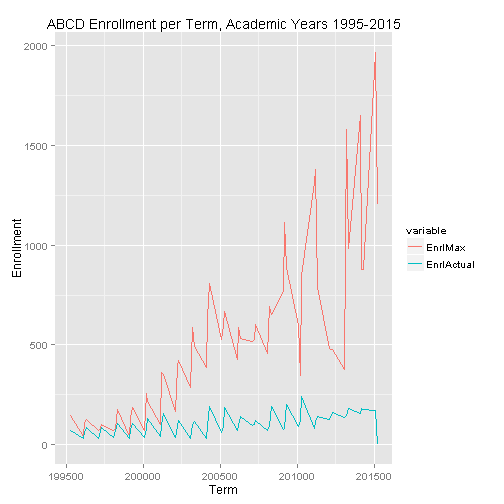

## Why?

- Problem: Subject Coordinator requested historical course enrollment data to facilitate planning. It took weeks to deliver the report.
- Goal: Provide subject coordinators and faculty administrators with timely access to the same data, and other tools for Enrollment Management.
- Technology: What is most cost effective way of providing data access to many people?

--- .class #id 

## How?

1. Enrollment data extracted from school ERP system to a text file
2. Used R to automate processing of the data
3. Used R's Shiny package to create interactive web app
4. Published prototype web app on Github. 
5. Ideal is a secure intranet server within the school network.

--- .class #id

## Chart Sample
How effective is the planning and utilization of capacity?
 

--- .class #id

## Detailed Data Table
Investigate trends in the data, or find "dirty data"
<!-- html table generated in R 3.1.2 by xtable 1.7-4 package -->
<!-- Sun Feb 22 02:06:42 2015 -->
<table border=1>
<tr> <th>  </th> <th> Subject </th> <th> CrseNumb </th> <th> AcyrCode </th> <th> Term </th> <th> Section </th> <th> EnrlMax </th> <th> EnrlActual </th>  </tr>
  <tr> <td align="right"> 10 </td> <td> ABCD </td> <td> 101 </td> <td align="right"> 1995 </td> <td align="right"> 199530 </td> <td> R16 </td> <td align="right">  35 </td> <td align="right">  24 </td> </tr>
  <tr> <td align="right"> 11 </td> <td> ABCD </td> <td> 101 </td> <td align="right"> 1995 </td> <td align="right"> 199530 </td> <td> R40 </td> <td align="right">  20 </td> <td align="right">  13 </td> </tr>
  <tr> <td align="right"> 19 </td> <td> ABCD </td> <td> 110 </td> <td align="right"> 1995 </td> <td align="right"> 199620 </td> <td> R16 </td> <td align="right">  35 </td> <td align="right">  16 </td> </tr>
  <tr> <td align="right"> 20 </td> <td> ABCD </td> <td> 110 </td> <td align="right"> 1995 </td> <td align="right"> 199620 </td> <td> R40 </td> <td align="right">  35 </td> <td align="right">  13 </td> </tr>
  <tr> <td align="right"> 21 </td> <td> ABCD </td> <td> 1101 </td> <td align="right"> 1996 </td> <td align="right"> 199630 </td> <td> R16 </td> <td align="right">  20 </td> <td align="right">  12 </td> </tr>
  <tr> <td align="right"> 22 </td> <td> ABCD </td> <td> 1101 </td> <td align="right"> 1996 </td> <td align="right"> 199630 </td> <td> R17 </td> <td align="right">  20 </td> <td align="right">  20 </td> </tr>
  <tr> <td align="right"> 23 </td> <td> ABCD </td> <td> 1101 </td> <td align="right"> 1996 </td> <td align="right"> 199630 </td> <td> R40 </td> <td align="right">  20 </td> <td align="right">  22 </td> </tr>
  <tr> <td align="right"> 24 </td> <td> ABCD </td> <td> 1101 </td> <td align="right"> 1997 </td> <td align="right"> 199730 </td> <td> R16 </td> <td align="right">  35 </td> <td align="right">  30 </td> </tr>
  <tr> <td align="right"> 25 </td> <td> ABCD </td> <td> 1101 </td> <td align="right"> 1997 </td> <td align="right"> 199730 </td> <td> R17 </td> <td align="right">   0 </td> <td align="right">   0 </td> </tr>
  <tr> <td align="right"> 26 </td> <td> ABCD </td> <td> 1101 </td> <td align="right"> 1997 </td> <td align="right"> 199730 </td> <td> R40 </td> <td align="right">  20 </td> <td align="right">  16 </td> </tr>
   </table>
